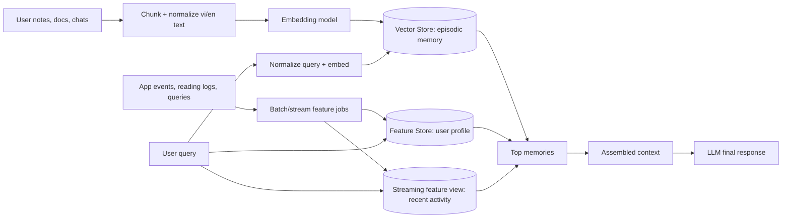

# Bonus Architecture - Hybrid Memory for a Vietnamese Cloud Learner

**Contributors:** Zheng Defu

## Goal

This POC designs memory for a personal AI assistant used by a Vietnamese engineer learning Cloud Native and AI Engineering. The user often reads English documentation but asks questions in Vietnamese mixed with English, such as "summary cloud security" or "tai lieu ve autoscaling". The assistant needs to remember documents and notes the user has read, stable preferences such as language and topics, and very recent activity from the last hour.

## Architecture

For the minimal code demo, `agent.py` replaces Qdrant and Feast with local Python structures. The boundaries stay the same: episodic memory behaves like a vector store, stable profile behaves like an online feature store, and recent queries behave like a streaming feature view. Production would swap the adapters without changing the agent flow.

## Decision 1: Chunking Strategy

I choose paragraph-level semantic chunks with a soft limit of 300-500 tokens. In the POC this is approximated by splitting on paragraphs and long sentences. In production, the same policy would run before embedding and upserting into Qdrant with payload fields like `user_id`, `source`, `created_at`, `topic`, and `language`.

The tradeoff is retrieval quality vs storage cost vs context window. Per-message chunks are cheap and precise, but they lose surrounding context: "HPA uses CPU" is less useful without the previous sentence saying it is about Kubernetes autoscaling. Per-conversation chunks preserve context, but retrieval becomes noisy and expensive because a single hit can contain multiple unrelated topics. Paragraph-level chunks are a middle path: they are small enough for top-k retrieval and large enough to explain a concept. For Vietnamese users, paragraph chunking is also robust when tokenization is imperfect.

## Decision 2: Feature Schema

I choose tabular profile features first, not embedding-based profile features.

| Feature | Entity | TTL | Source | Use |
| --- | --- | --- | --- | --- |
| `preferred_language` | `user_id` | 90 days | settings + conversations | prompt language |
| `reading_speed_wpm` | `user_id` | 30 days | reading events | recommend length |
| `topic_affinity` | `user_id` | 14 days | docs + queries | rerank and recommend |
| `active_hours` | `user_id` | 30 days | app events | timing preference |
| `queries_last_hour` | `user_id` | 1 hour | streaming logs | fresh context |
| `fatigue_signal` | `user_id` | 1 hour | query length/time | adapt response detail |

Tabular features are easier to debug, serve online, and explain in the final prompt: "User prefers vi-en-mix and likes Kubernetes/security." Embedding features could capture latent preferences, but they are harder to inspect and update safely. Since this is a learning assistant, explainability matters: wrong personalization should be visible and fixable.

## Decision 3: Freshness Strategy

Freshness depends on the use case. Recent activity such as "queries_last_hour" should update sub-second through a streaming push path, because the assistant needs to answer "Toi dang quan tam gi gan day?" immediately. Newly read documents should appear in episodic search within seconds to one minute, because chunking and embedding take time but the user expects recall soon after reading. Stable profile features such as topic affinity and reading speed can refresh every 5 minutes or daily, because one document should not permanently rewrite the profile.

This maps to lab concepts: streaming feature views handle fresh aggregates, the online feature store serves low-latency profile reads, and the vector store handles semantic recall. For training data and analytics, point-in-time joins are needed so a model only sees profile values that existed at the event time.

## Rejected Option

I considered storing all episodic memory inside the feature store as embedding features. I rejected it because the lifecycle is different. Episodic memory changes whenever the user reads a document or saves a note, and it needs top-k semantic search plus re-indexing. Stable profile features change more slowly and need TTL, point-in-time correctness, and online serving. Keeping them separate makes each system simpler: vector store for recall, feature store for personalization.

## Vietnamese Context

Vietnamese users often code-switch: "cloud security la gi", "summary IAM", "tu dong mo rong Kubernetes". Retrieval should normalize no-accent text and include a small synonym layer for common terms: "bao mat" <-> "security", "tu dong mo rong" <-> "autoscaling", "ha tang" <-> "infrastructure". For production, I would test multilingual embeddings and compare whitespace splitting, `underthesea`, and `pyvi`. Whitespace splitting is simple but weak for compounds like "bao mat" or "dam may"; Vietnamese tokenizers help but add dependency and possible domain errors for cloud terms.

Privacy is also important. A Vietnamese personal assistant may store work notes, company infrastructure details, or regulated personal data. Each memory must include `user_id` filtering at retrieval time, and sensitive memories should have deletion, encryption at rest, and shorter TTLs.

## What This POC Does Not Handle Yet

The demo does not run real Qdrant, Feast, or an LLM. It does not implement encryption, user-managed delete/edit memory, multi-device sync, or production-grade Vietnamese NLP. It also uses a simple lexical scorer instead of real embeddings. That is intentional: the code demonstrates the architecture contract, while the document explains how the same design maps to lab components.
